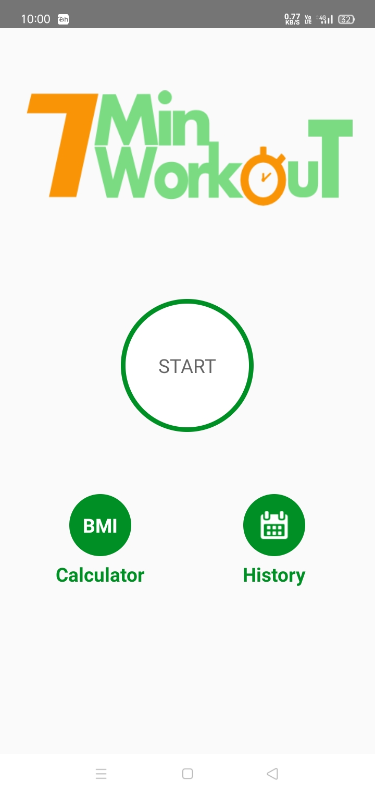
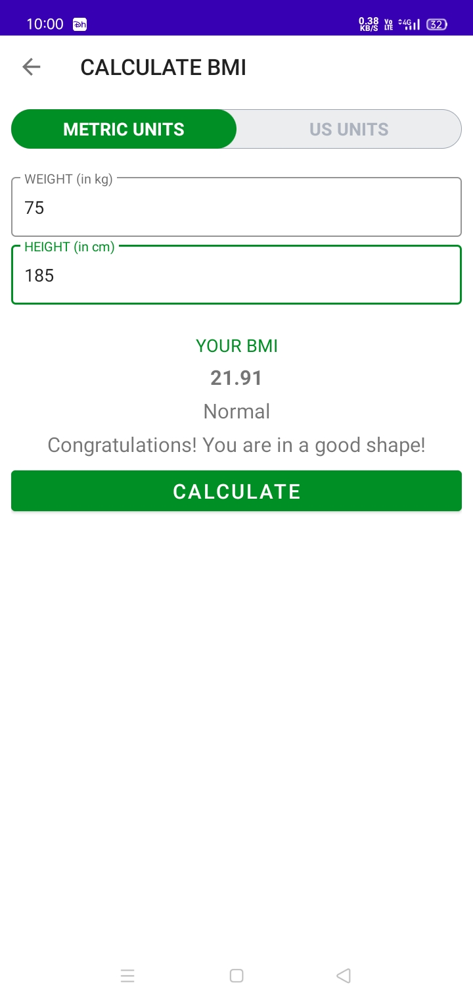
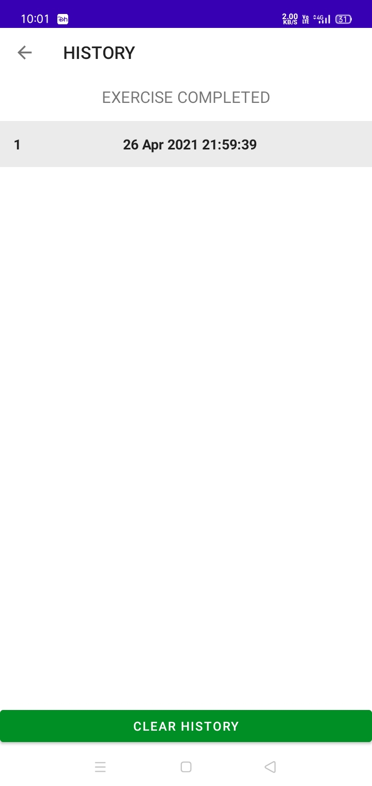
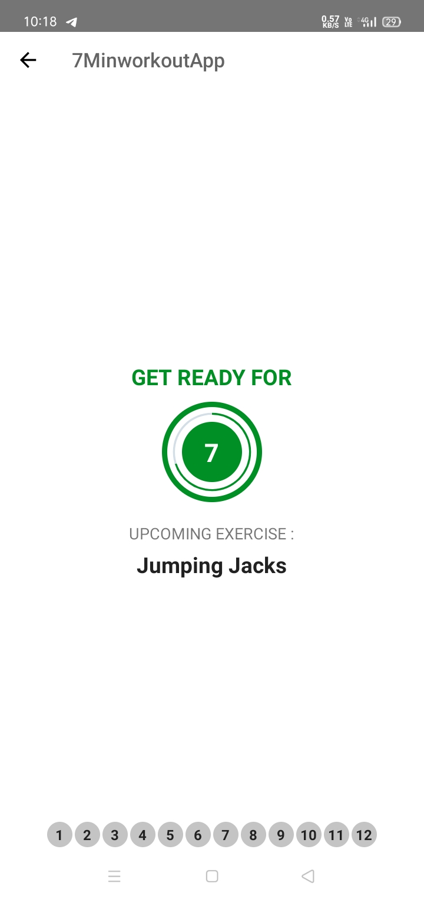
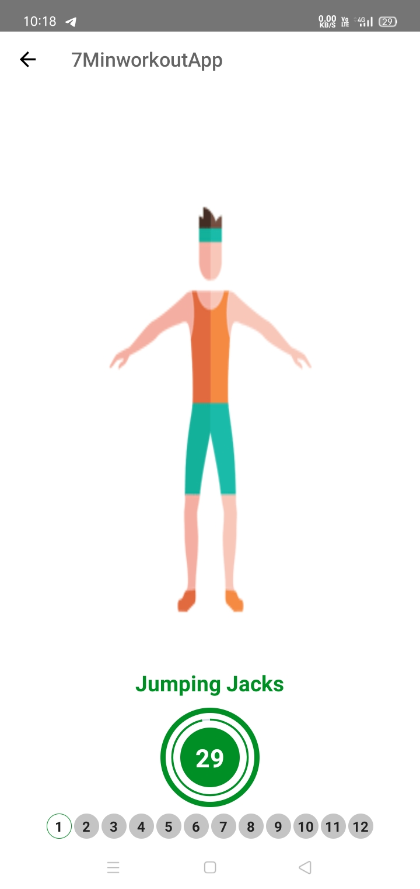

# 7MinworkoutApp

It is a Koltin Based android app developed on MVVM Architecture . In this app main focus is on Room Database , Glide library , custom Buttons , RecyclerViews and UI .
The Theme is Basic Workout App , Hence a user can perform some homeworkout and can calculate BMI to be fit .

# SCREENSHOTS

